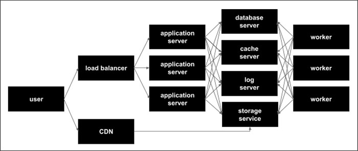

Hosting
=======
The Maha Platform is hosted within the Amazon Cloud, leveraging a variety of
network infrastructure technologies. All provisioning and configuration
is automated using `Red Hat Ansible <https://www.ansible.com/>`_ to enable
resources to be quickly removed, added, or replaced as needed.

Load Balancer
-------------
All inbound traffic from the public internet is balanced across a number of
application servers using Amazon's
`Elastic Load Balancer <https://aws.amazon.com/elasticloadbalancing/>`_
service. This load balancer is highly available and fault tolerant allowing for
large spikes in traffic and capable of distributing traffic between all
available application servers.

CDN (Content Delivery Network)
------------------------------
Static assets (uploaded files, images, JavaScript, and CSS) are cached and
served from Amazon's
`CloudFront <https://aws.amazon.com/cloudfront/>`_
content delivery network. This ensures that all data files and client side
source files are highly available to users and don't unnecessarily burden the
application servers for serving static files.

Application Server
------------------
The application servers are custom built nginx/nodejs application servers built
on Amazon's EC2 compute service. Each application server receives traffic from
the load balancer, performs the the work of the Maha Platform, and sends a
response back to the user through the load balancer.

Database Server
---------------
The database server runs PostgreSQL 12.2 and is built on Amazon's EC2 compute
service. The database server provide data to both the application servers and
the worker to help them do work and fulfill requests.

Cache Server
------------
The cache server runs Redis and is built using Amazon's EC2 compute service. The
cache server is able to save data for quick retrieval as well as pass messages
and jobs back and forth between the application servers and workers.

Log Server
------------
The log server runs GreyLog and is built using Amazon's EC2 compute service. The
log server receives logging output from every application server and worker
and stores it in a database. It also serves a web interface that enables
developers to monitoring performance and quickly track down errors in real time
as they occur.

Storage Service
----------------
All uploaded file data is stored in Amazon's cloud based storage service S3.
These assets are stored securely, redundantly, and can only be accessed through
the Maha interface and once successfully authenticated.

Worker
------
Workers perform time consuming, non user-interface related work for the application
servers (e.g. sending a 10,000 recipient email campaign) They receive their jobs
via messages passed through the cache server and notify both the application
servers and the relevant users via secure web socket channels

Ansible Automation
------------------
All server configuration is automated through Ansible and enables developers to
add additional replace servers as needed. Here are the Ansible configurations:
