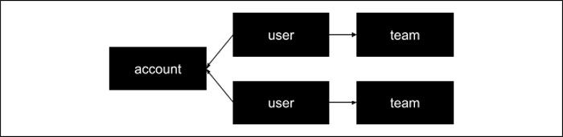

User Model
==========
Every person who logs into Maha has an account. Your account is where you
manage your password, your profile, connection to 3rd party applications
(Gogole Drive, Box, etc), and various security features. When a person is
assigned to a team, they become a user. An account may be connected to
several teams and hence have several users - one for each team.

Accounts
--------
Every person who logs into Maha has an account. Your account is where you
manage your password, your profile, connection to 3rd party applications
(Gogole Drive, Box, etc), and various security features.

Users
-----
When an account is assigned to a team, it becomes a user. Although an account
may have several users, it may only have 1 user per team
